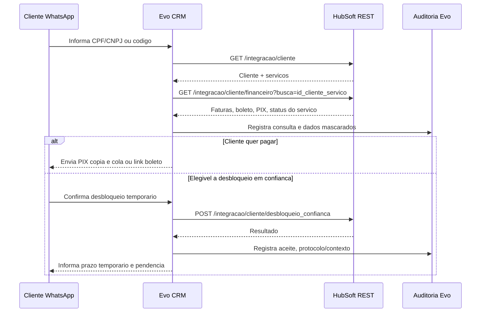
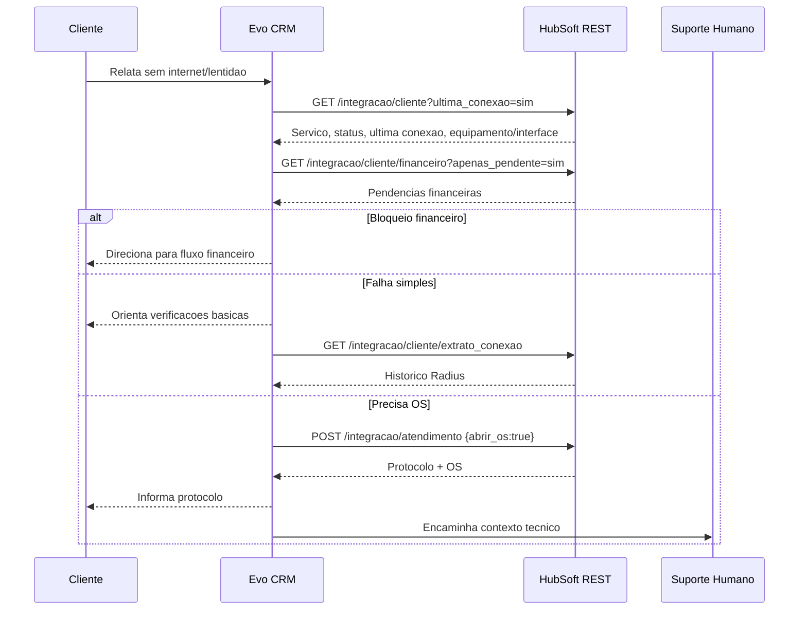
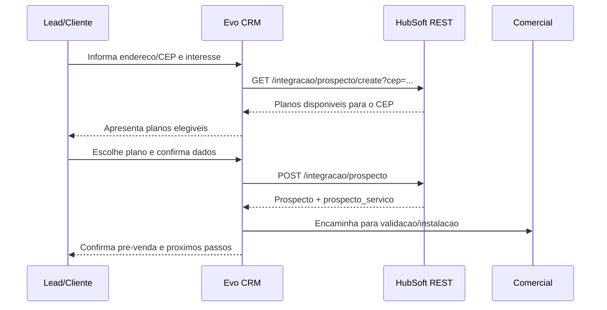

# Technical Research: API HubSoft para Integracao Evo CRM

**Data:** 2026-05-24  
**Autor:** Mary (Business Analyst)  
**Projeto:** Evo CRM Community  
**Tipo:** Technical Research  
**Pre-requisito:** `docs/hubsoft-integration/domain-research-isp-brasil-hubsoft.md`

## Resumo executivo

A integracao Evo CRM + HubSoft deve usar a API REST como trilha principal para a primeira versao, porque os endpoints publicos documentados ja cobrem identificacao de clientes, consulta financeira, faturas com boleto/PIX, desbloqueio em confianca, abertura de atendimento, consulta de OS, prospectos e planos disponiveis por CEP. A API GraphQL e promissora para leitura flexivel e telas agregadas, mas a documentacao publica confirma apenas o endpoint `/graphql/v1`, autenticacao OAuth compartilhada, paginacao, ordenacao e exemplo de query `clientes`; o schema completo precisa ser sincronizado no Postman contra o tenant real HubSoft.

Para os tres setores, a arquitetura recomendada e:

- **Financeiro:** REST primeiro, ancorado em `id_cliente_servico`, com cache curto, mascaramento de dados e trilha de auditoria.
- **Suporte:** REST primeiro para cliente, ultima conexao, extrato Radius, atendimento e OS; diagnostico de OLT/ONU em tempo real e teste de sinal devem ser tratados como gap ate confirmar API privada, GraphQL schema ou integracao de rede disponivel no provedor.
- **Vendas:** REST primeiro para prospecto, planos por CEP e CRM; cobertura/viabilidade real deve ser validada com zona de atendimento, regras comerciais do provedor e, se necessario, etapa humana.

## Fontes verificadas

| Fonte | Uso nesta pesquisa |
|---|---|
| Repositorio oficial `hubsoftbrasil/api` | Documentacao REST, exemplos, Postman e arquivos `.rst`: https://github.com/hubsoftbrasil/api |
| Documentacao oficial REST HubSoft | Linkada pelo README oficial: https://docs.hubsoft.com.br/ |
| Wiki GraphQL HubSoft | Endpoint, autenticacao, paginacao, schema via Postman: https://wiki.hubsoft.com.br/pt-br/api-graphql |
| Wiki HubSoft | Indice geral e modulos do sistema: https://wiki.hubsoft.com.br/pt-br/home |
| Domain Research anterior | Contexto ISP, LGPD, Anatel e regras de negocio locais: `docs/hubsoft-integration/domain-research-isp-brasil-hubsoft.md` |

## 1. Autenticacao

| Item | Resultado |
|---|---|
| Metodo | OAuth2 Password Grant em `POST /oauth/token` |
| Credenciais | `client_id`, `client_secret`, `username`, `password`, `host` |
| Token | `token_type` + `access_token`, enviado em `Authorization: Bearer <token>` |
| Expiracao | Campo `expires_in`; exemplo oficial mostra `2592000` segundos, equivalente a 30 dias |
| Renovacao | Gerar novo token ao expirar ou quando a API retornar `HTTP 401` |
| Escopos | Nao ha escopos granulares documentados publicamente; permissao depende do usuario/tenant HubSoft |
| GraphQL | Usa a mesma autenticacao OAuth da API publica; usuario precisa estar liberado para GraphQL |
| Rate limits | Nao ha rate limit numerico documentado. Ha alertas contra chamadas pesadas e repetidas em `cliente/all` e GraphQL |

Exemplo:

```http
POST https://{hubsoft_host}/oauth/token
Content-Type: application/json

{
  "grant_type": "password",
  "client_id": "3",
  "client_secret": "client-secret",
  "username": "usuario@provedor.com.br",
  "password": "senha"
}
```

## 2. Busca de clientes

| Caso | Metodo | Path | Parametros | Resposta util |
|---|---:|---|---|---|
| Buscar cliente por CPF/CNPJ | GET | `/api/v1/integracao/cliente` | `busca=cpf_cnpj`, `termo_busca`, `limit`, `cancelado`, `ultima_conexao`, `incluir_contrato` | `id_cliente`, `codigo_cliente`, `nome_razaosocial`, `cpf_cnpj`, telefones, email, `servicos[]` |
| Buscar por nome | GET | `/api/v1/integracao/cliente` | `busca=nome_razaosocial` ou `nome_fantasia` | Cliente + servicos |
| Buscar por telefone | GET | `/api/v1/integracao/cliente` | `busca=telefone` | Cliente + servicos |
| Buscar por login/IP/MAC | GET | `/api/v1/integracao/cliente` | `busca=login_radius`, `ipv4` ou `mac` | Cliente + servicos e dados tecnicos |
| Buscar por codigo do cliente | GET | `/api/v1/integracao/cliente` | `busca=codigo_cliente` | Cliente + servicos |
| Buscar por contrato/servico | GET | `/api/v1/integracao/cliente` | Nao ha busca por numero de contrato documentada; usar `id_cliente_servico` quando conhecido via outros fluxos | Gap para numero de contrato |
| Listagem ampla | GET | `/api/v1/integracao/cliente/all` | `data_inicio`, `data_fim`, `cancelado`, `ultima_conexao`, `relacoes`, `limit`, `offset` | Todos clientes filtrados; usar com cautela |

Campos relevantes retornados em `servicos[]`:

- `id_cliente_servico`, `id_servico`, `numero_plano`, `nome`, `valor`
- `status`, `status_prefixo`, `tecnologia`
- `login`, `ipv4`, `ipv6`
- `ultima_conexao` quando `ultima_conexao=sim`
- `interface`, `interface_roteamento`, `equipamento_conexao`, `equipamento_roteamento`
- `pacotes`, `senhas`
- `endereco_cadastral`, `endereco_instalacao`, `endereco_fiscal`, `endereco_cobranca`
- `alerta` e `alerta_mensagens`, uteis para comunicados de massiva

Exemplo critico:

```http
GET /api/v1/integracao/cliente?busca=cpf_cnpj&termo_busca=12345678901&limit=5&cancelado=nao&ultima_conexao=sim
Authorization: Bearer <token>
Accept: application/json
```

Resposta resumida:

```json
{
  "status": "success",
  "clientes": [
    {
      "id_cliente": 11201,
      "codigo_cliente": 421,
      "nome_razaosocial": "CLIENTE TESTE",
      "cpf_cnpj": "12345678901",
      "telefone_primario": "37999999999",
      "servicos": [
        {
          "id_cliente_servico": 22703,
          "nome": "500MB",
          "valor": 99.9,
          "status": "Servico Habilitado",
          "status_prefixo": "servico_habilitado",
          "tecnologia": "FIBRA",
          "ultima_conexao": {
            "conectado": true,
            "status_txt_resumido": "CONECTADO HA 0 DIA(S), 2 HORA(S)"
          }
        }
      ]
    }
  ]
}
```

## 3. Modulo Financeiro

| Caso | Metodo | Path | Parametros | Resposta util |
|---|---:|---|---|---|
| Situacao financeira do servico | GET | `/api/v1/integracao/cliente/financeiro` | `busca=cpf_cnpj`, `codigo_cliente` ou `id_cliente_servico`; `apenas_pendente=sim` | Faturas pendentes/liquidadas e status do servico na resposta |
| Listar faturas em aberto | GET | `/api/v1/integracao/cliente/financeiro` | `apenas_pendente=sim`, `limit`, `data_inicio`, `data_fim`, `tipo_data` | `faturas[]` |
| Consultar financeiro geral | GET | `/api/v1/integracao/financeiro` | `busca`, `termo_busca`, `tipo_resultado`, `apenas_quitado`, datas, ordenacao | Contas a receber; bom para conciliacao e relatorios |
| Obter boleto | GET | `/api/v1/integracao/cliente/financeiro` | Igual acima | `linha_digitavel`, `codigo_barras`, `link`, `beneficiario`, `nosso_numero` |
| Obter PIX | GET | `/api/v1/integracao/cliente/financeiro` | Igual acima | `pix_copia_cola`; QR Code nao aparece como campo separado na doc REST |
| Desbloqueio em confianca | POST | `/api/v1/integracao/cliente/desbloqueio_confianca` | `id_cliente_servico`, `dias_desbloqueio` | Mensagem de sucesso/erro; valida regra configurada no painel |
| Desconectar sessao Radius | GET | `/api/v1/integracao/cliente/solicitar_desconexao/{id_cliente_servico}` | path param `id_cliente_servico` | Forca desconexao se concentrador/RADIUS permitirem |
| Lancar evento de faturamento | POST | `/api/v1/integracao/financeiro/evento_faturamento` | `id_cliente_servico`, `id_tipo_servico`, `tipo`, `descricao`, `valor`, parcelamento | Cria acrescimo/desconto |

Exemplo: listar faturas pendentes por servico:

```http
GET /api/v1/integracao/cliente/financeiro?busca=id_cliente_servico&termo_busca=22703&apenas_pendente=sim&limit=10
Authorization: Bearer <token>
```

Resposta resumida:

```json
{
  "status": "success",
  "faturas": [
    {
      "id_fatura": 43653,
      "linha_digitavel": "75691...",
      "codigo_barras": "75698...",
      "link": "https://{host}/pdf/fatura/...",
      "tipo_cobranca": "boleto_bancario",
      "valor": 10,
      "data_vencimento": "10/07/2018",
      "data_pagamento": null,
      "pix_copia_cola": "0002010102...",
      "cliente": {
        "codigo_cliente": 1162,
        "nome_razaosocial": "CLIENTE TESTE",
        "servico": {
          "id_cliente_servico": 22703,
          "nome": "500MB",
          "status_prefixo": "servico_habilitado"
        }
      }
    }
  ]
}
```

Exemplo: desbloqueio em confianca:

```http
POST /api/v1/integracao/cliente/desbloqueio_confianca
Authorization: Bearer <token>
Content-Type: application/json

{
  "id_cliente_servico": "22703",
  "dias_desbloqueio": "1"
}
```

## 4. Modulo Suporte

| Caso | Metodo | Path | Parametros | Resposta util |
|---|---:|---|---|---|
| Abrir protocolo de suporte | POST | `/api/v1/integracao/atendimento` | `id_cliente_servico`, `id_tipo_atendimento`, `descricao`, `nome`, `telefone`, `email`, `abrir_os` | `id_atendimento`, `protocolo`, `ordens_servico[]` |
| Listar protocolos do cliente | GET | `/api/v1/integracao/cliente/atendimento` | `busca=cpf_cnpj`, `codigo_cliente`, `id_cliente_servico` ou `protocolo`; `apenas_pendente` | Atendimentos, status, OS vinculadas |
| Consultar atendimentos paginados | POST | `/api/v1/integracao/atendimento/paginado/{quantidade}?page={pagina}` | `data_inicio`, `data_fim` | Backoffice/relatorio |
| Consultar OS do cliente | GET | `/api/v1/integracao/cliente/ordem_servico` | `busca=cpf_cnpj`, `codigo_cliente`, `id_cliente_servico` ou `numero_ordem_servico` | OS, status, tecnico, atendimento |
| Consultar OS geral | POST | `/api/v1/integracao/ordem_servico/consultar` | `consulta`, `data_inicio`, `data_fim`, `tipo_data`, ordenacao | OS por numero/nome/periodo |
| Agendar OS | POST | `/api/v1/integracao/ordem_servico/agendar` | `id_ordem_servico` | Status de agendamento |
| Reagendar/remover agendamento | POST | `/api/v1/integracao/ordem_servico/reagendar`, `/remover_agendamento` | Confirmar payload nos `.rst` antes de usar | Operacao de agenda |
| Ultima conexao | GET | `/api/v1/integracao/cliente` | `ultima_conexao=sim` | `conectado`, datas, NAS, IP e texto resumido |
| Extrato de conexao | GET | `/api/v1/integracao/cliente/extrato_conexao` | `busca=login`, `ipv4`, `ipv6_wan`, `ipv6_lan`; datas | Sessoes Radius, trafego, NAS, IP |
| Configurar autenticacao | POST | `/api/v1/integracao/cliente/configurar_autenticacao` | `id_cliente_servico`, `id_interface_conexao`, `phy_addr`, `password` | Altera parametro tecnico do servico |
| Resetar MAC | POST | `/api/v1/integracao/cliente/reset_mac_addr` | `id_cliente_servico` | Limpa MAC quando houver autenticacao |
| Consultar equipamentos | GET | `/api/v1/integracao/rede/equipamento` | sem parametros documentados | Equipamentos, interfaces, tipo/fabricante |
| Consultar zonas de atendimento | GET | `/api/v1/integracao/rede/zona_atendimento` | sem parametros documentados | Zonas, interfaces, OLT/AP associado |

Ponto critico: a documentacao publica nao comprova endpoint para "executar teste de sinal/linha ONU/OLT" nem leitura direta de potencia optica, RX/TX, LOS/PON ou status detalhado da ONU. O que existe publicamente e informacao indireta: status do servico, ultima conexao Radius, extrato de conexao, interface/equipamento associado, zona de atendimento e dados de autenticacao.

Exemplo: abrir atendimento com OS:

```http
POST /api/v1/integracao/atendimento
Authorization: Bearer <token>
Content-Type: application/json

{
  "id_cliente_servico": "22703",
  "id_tipo_atendimento": 109,
  "descricao": "Cliente relata sem acesso. Bot validou energia/cabos e servico esta habilitado.",
  "nome": "Cliente Teste",
  "telefone": "37999999999",
  "email": "cliente@example.com",
  "abrir_os": true
}
```

## 5. Modulo Vendas

| Caso | Metodo | Path | Parametros | Resposta util |
|---|---:|---|---|---|
| Listar planos por CEP | GET | `/api/v1/integracao/prospecto/create?cep={cep}` | `cep` obrigatorio | `servicos[]` com `id_servico`, `descricao`, `valor`, `velocidade_download`, `velocidade_upload` |
| Criar prospecto/pre-venda | POST | `/api/v1/integracao/prospecto` | `cep`, `servico`, `nome_razaosocial`, `cpf_cnpj`, `telefone`, `tipo_pessoa`, endereco, `id_crm` opcional | `id_prospecto`, `prospecto_servico` |
| Buscar prospecto | GET | `/api/v1/integracao/prospecto?busca={nome}` | Busca por nome/razao social | `prospectos[]` |
| Listar prospectos | GET | `/api/v1/integracao/prospecto/all` | `convertido=sim/nao` | Prospectos, conversao e dados cadastrais |
| Listar CRMs | GET | `/api/v1/integracao/crm/all` | sem parametros | `id_crm`, `nome` |
| Consultar OS de instalacao | GET | `/api/v1/integracao/cliente/ordem_servico` ou POST `/ordem_servico/consultar` | filtros por cliente/periodo | Status de instalacao quando ja convertido |
| Cobertura por endereco/CEP | GET | `/api/v1/integracao/prospecto/create?cep={cep}` | `cep` | Retorna planos por unidade de negocio do CEP; nao prova viabilidade fisica porta/CTO |

Exemplo: planos por CEP:

```http
GET /api/v1/integracao/prospecto/create?cep=35560000
Authorization: Bearer <token>
```

Exemplo: criar prospecto:

```http
POST /api/v1/integracao/prospecto
Authorization: Bearer <token>
Content-Type: application/json

{
  "cep": "35560000",
  "servico": { "id_servico": 1330, "valor": 254.9 },
  "cpf_cnpj": "68346567000158",
  "telefone": "3732818000",
  "nome_razaosocial": "Empresa XPTO LTDA",
  "tipo_pessoa": "pj",
  "bairro": "Centro",
  "endereco": "Praca Getulio Vargas",
  "numero": 77,
  "id_crm": 1
}
```

## 6. GraphQL

### O que esta publicamente confirmado

| Item | Confirmacao |
|---|---|
| Endpoint | `POST /graphql/v1` |
| Autenticacao | Mesma OAuth da API publica HubSoft |
| Habilitacao | Usuario precisa estar liberado para usar GraphQL no HubSoft |
| Query comprovada | `clientes(page: 1, first: 5)` |
| Paginacao | `page`, `first`, `paginatorInfo.currentPage`, `lastPage`, `total` |
| Ordenacao | Varias consultas suportam `orderBy`, mas depende do schema |
| Datas | Varias consultas suportam `de` e `ate`, mas depende do schema |
| Schema | Deve ser sincronizado no Postman ou ferramenta GraphQL contra o tenant real |

Exemplo oficial adaptado:

```graphql
query Clientes {
  clientes(page: 1, first: 5) {
    paginatorInfo {
      currentPage
      lastPage
      total
    }
    data {
      id_cliente
      codigo_cliente
      nome_razaosocial
      cpf_cnpj
    }
  }
}
```

### Queries e mutations por modulo

Nao e tecnicamente correto afirmar a lista completa de queries/mutations sem introspeccao do schema do tenant. A wiki informa que o Postman consegue sincronizar o schema e expor consultas, filtros e campos disponiveis. Portanto:

- **Clientes:** query `clientes` comprovada; provavel melhor candidata para telas agregadas e busca paginada, mas filtros precisam ser confirmados no schema.
- **Financeiro:** queries de faturas/cobrancas precisam ser confirmadas no schema; REST ja resolve o caso critico.
- **Suporte:** queries de atendimentos/OS precisam ser confirmadas no schema; REST ja resolve abertura e consulta.
- **Vendas:** queries de prospectos/servicos/CRM precisam ser confirmadas no schema; REST ja resolve pre-venda documentada.
- **Mutations:** nenhuma mutation especifica de desbloqueio, abertura de protocolo ou prospecto foi comprovada na documentacao publica. Usar REST ate validar introspeccao.

## 7. Gaps identificados

| Gap | Impacto | Mitigacao recomendada |
|---|---|---|
| Rate limit numerico nao documentado | Risco de abuso e bloqueio operacional | Implementar cache, backoff, filas e limites internos por tenant/cliente |
| Escopos OAuth nao documentados | Dificulta menor privilegio por modulo | Criar usuario tecnico dedicado por integracao e validar permissoes no HubSoft |
| Numero de contrato como busca direta nao comprovado | Atendimento pode receber contrato em vez de CPF/codigo | Resolver via `cliente` com `incluir_contrato=sim` e confirmar campos no tenant |
| Bloqueio/desbloqueio definitivo de servico nao documentado como endpoint publico | Acoes sensiveis podem exigir painel humano ou API privada | Usar desbloqueio em confianca documentado; bloquear/desbloquear definitivo so apos confirmacao HubSoft |
| Teste de sinal ONU/OLT nao documentado | Diagnostico tecnico fica incompleto | Usar ultima conexao/extrato/equipamentos; integrar API do NMS/OLT ou confirmar endpoint privado |
| PIX QR Code separado nao documentado | Bot pode precisar QR visual | Gerar QR no Evo a partir de `pix_copia_cola`, sem alterar conteudo |
| Consulta de baixa PIX em tempo real nao comprovada | Risco de prometer reconexao antes da baixa | Consultar faturas novamente e informar prazo de processamento |
| Viabilidade fisica por CTO/porta nao comprovada | Risco de vender onde nao ha porta/capacidade | Usar planos por CEP como pre-filtro e exigir validacao comercial/tecnica |
| Schema GraphQL completo nao publico | Nao permite prometer queries/mutations | Rodar introspeccao no tenant e versionar snapshot do schema |

## 8. REST vs GraphQL por caso de uso

| Caso de uso | Recomendacao | Motivo |
|---|---|---|
| Identificar cliente por CPF/CNPJ/telefone/codigo | REST | Endpoint documentado com filtros e resposta rica |
| Montar contexto 360 do cliente no Evo | REST agora; GraphQL depois | REST cobre dados principais; GraphQL pode reduzir overfetch apos schema |
| Enviar boleto/PIX | REST | Campos documentados em fatura |
| Desbloqueio em confianca | REST | Endpoint documentado e validado por regra do painel |
| Abrir atendimento/OS | REST | Endpoint documentado, retorna protocolo |
| Consultar historico de atendimento/OS | REST | Endpoints documentados por cliente e paginados |
| Diagnostico tecnico de conexao | REST + NMS/OLT externo | HubSoft REST fornece sinais indiretos; teste OLT/ONU nao comprovado |
| Listar planos e criar prospecto | REST | Endpoints documentados |
| Dashboard interno analitico | GraphQL apos introspeccao | Melhor selecao de campos e paginacao flexivel |
| Mutacoes operacionais sensiveis | REST ate prova em contrario | Mutations publicas nao documentadas |

## 9. Sequencias simplificadas

### Financeiro



### Suporte



### Vendas



## 10. Recomendacao de implementacao no Evo CRM

1. Criar um conector HubSoft isolado no backend do Evo CRM, nunca diretamente no frontend.
2. Persistir tokens OAuth criptografados e renovar quando `expires_in` vencer ou houver `401`.
3. Normalizar tudo em torno de `id_cliente_servico`; `id_cliente` sozinho nao basta para multi-contrato.
4. Aplicar mascaramento de CPF/CNPJ, boleto e dados financeiros nas mensagens e logs.
5. Criar cache curto para consultas pesadas: cliente 30-120s, financeiro 30-60s, planos por CEP 10-30min.
6. Implementar idempotencia para acoes: abertura de atendimento, envio de cobranca e desbloqueio em confianca.
7. Tratar `cliente/all` como rotina batch, nunca chamada de bot em tempo real.
8. Antes de usar GraphQL em producao, salvar snapshot do schema introspectado do tenant e gerar testes de contrato.
9. Para suporte avancado, planejar integracao adicional com NMS/OLT/Radius se o provedor precisar teste optico real.

## 11. Checklist de validacao no tenant real

- [ ] Confirmar host HubSoft, `client_id`, `client_secret` e usuario tecnico.
- [ ] Validar permissao do usuario para REST e GraphQL.
- [ ] Testar `GET /api/v1/integracao/cliente` com CPF/CNPJ, telefone, codigo e `ultima_conexao=sim`.
- [ ] Testar `GET /api/v1/integracao/cliente/financeiro` com `id_cliente_servico`.
- [ ] Confirmar se `pix_copia_cola`, `link`, `linha_digitavel` aparecem para bancos reais do provedor.
- [ ] Confirmar regra de desbloqueio em confianca no painel HubSoft.
- [ ] Testar abertura de atendimento com e sem `abrir_os`.
- [ ] Testar planos por CEP e criacao de prospecto em ambiente seguro.
- [ ] Sincronizar schema GraphQL no Postman e registrar queries/mutations disponiveis.
- [ ] Confirmar se ha endpoint privado/contratado para OLT/ONU, potencia optica ou teste de linha.

